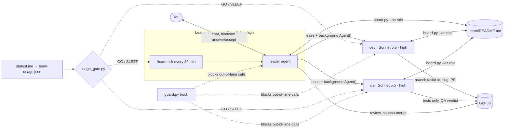
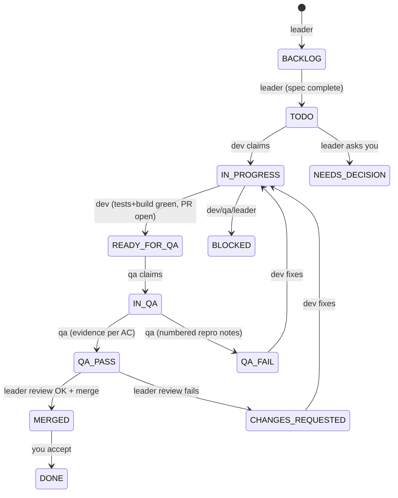
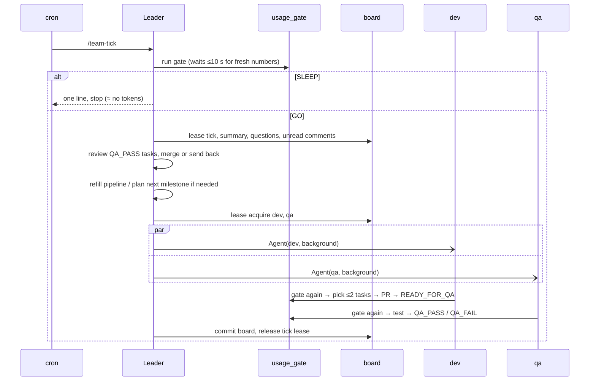

# Leader / Dev / QA agent team for Claude Code

A leader on **Opus 5.5 (xhigh effort)** plans and reviews; a **dev** and a **QA** on **Sonnet 5.5 (high effort)** implement and test.
They wake every 30 minutes, work only while your plan usage is under the limits, and coordinate through one file: `.team/README.md`.

## 1. Is it possible? Requirement by requirement

| You asked for | Possible? | How it is built | Caveats |
|---|---|---|---|
| Session starts as an orchestrator on Opus, extra effort | **Yes** | The plugin's own `settings.json` sets `agent: leader` (the only field a plugin's `settings.json` carries into an installing project — model/effort do not); `bin/team start` passes `--model/--effort` explicitly to cover those. | "Extra" = `xhigh`. `max` exists but only persists via `CLAUDE_CODE_EFFORT_LEVEL=max` (`TEAM_LEADER_EFFORT=max bin/team start`). |
| Leader plans, specifies tasks, diagrams, roadmap, security/perf | **Yes** | `leader-planning`, `leader-review`, `team-init` skills (task template with mermaid diagrams, decision records, health checklist, stability check → next milestone). | Quality depends on the vision you give it in `/team-init`. |
| Ask me before choosing a tech stack, with recommendation + alternatives | **Yes** | Decision-record protocol: interactive → `AskUserQuestion`; while you are away → question written to README §3, dependent tasks `NEEDS_DECISION`, everything else keeps moving. | The heartbeat never asks interactively (it would freeze the loop). |
| Everything stored in a README; leader writes it, others only change status/comment | **Yes, enforced** | `board.py` (locked, atomic, transition table per role) + `guard.py` PreToolUse hook (blocks direct edits, wrong `--as`, pushes to main, merges). | The hook is a seatbelt against model mistakes, not a sandbox against a hostile agent. Add GitHub branch protection. |
| Leader monitors every 30 min | **Yes, with limits** | `/team-tick` fired by a session cron job (`7,37 * * * *`). | Fires only while the leader session is **open and idle**; ≤10 % jitter (~3 min); recurring jobs **expire after 7 days** (re-armed automatically); a long tick delays the next. See §5 for 24/7 hosting. |
| Dev (Sonnet 5.5 high): ≤2 tasks, branch per task, tests, build, PR to main, wait for QA | **Yes** | `dev` agent + `dev-workflow` skill + `worktree.py` (one git worktree per task) + WIP/per-wake limits enforced by `board.py claim`. | Needs `gh` or the GitHub MCP tools to open PRs. |
| QA picks dev's work, notes issues for dev, marks `QA_PASS` | **Yes** | `qa` agent + `qa-workflow`; verdicts only via the board; QA may add test files (only) to the task branch. | |
| Leader re-reviews `QA_PASS`, merges, marks for my review | **Yes** | `leader-review` skill; status `MERGED` = "merged, awaiting the owner"; you accept with `bin/team accept T-007` → `DONE`. | Merges go to the `develop` integration branch, not `main`; you promote with `bin/team promote` (§8). |
| Before working, check plan usage: weekly < 75 %, 5-hour session < 60 % | **Yes, via the statusLine** | Claude Code passes `rate_limits.five_hour/seven_day.used_percentage` to the statusLine command; `statusline.py` caches it, `usage_gate.py` decides. Runs first in the tick and in every dev/qa wake-up. | Pro/Max login only; numbers update on API responses; fails **closed** (sleeps) when unknown. Details in §4. |

Not built on purpose: **agent teams** (experimental, one team per session, no resume, no scheduled wake-ups) and **cloud routines** (minimum interval 1 hour, so a 30-minute heartbeat is impossible there).

## 2. Architecture



Task lifecycle (who may make each move):



One heartbeat:



## 3. Quick start

1. **Install the plugin** (once per machine): add this repo as a plugin marketplace and install
   from it — see `README.md` for the exact commands. Scope `user` makes it available in every
   project on the machine, which is the point.
2. **Per project, one manual step the plugin can't do for you**: a plugin's own `settings.json`
   only carries its `agent` field into the installing project — not `statusLine`. Add the
   statusLine block from `README.md` to *that project's* `.claude/settings.json` yourself, or
   the usage gate never leaves `SLEEP` (see §4). Everything else (agents, skills, the guard
   hook) activates automatically once the plugin is installed and the project folder is trusted.
3. **Trust the folder once** per project: run `claude` interactively and accept the trust
   dialog. Until then Claude Code ignores hooks and the statusLine — during testing without it,
   it printed `Ignoring 19 permissions.allow entries … this workspace has not been trusted`.
4. Log in with a **Pro/Max** plan (`rate_limits` is only provided for those).
5. `bin/team start` (or plain `claude`, once the plugin's `settings.json` has set the default
   agent). The leader briefs you and, on a fresh board, runs `/team-init`: it reads `docs/`,
   interviews you, fills the board, sets build/test/lint commands, creates the first tasks and
   arms the heartbeat.
6. Send one message once the statusLine has produced its first numbers; check `bin/team status`
   shows `GO five_hour=… seven_day=…` rather than "usage unknown".
7. Leave the session running (tmux / `bin/team bg`, §5). Watch `.team/README.md`; answer
   questions with `bin/team answer Q-001 "…"`, accept merged work with `bin/team accept T-007`,
   or just tell the leader.

Commands: `team start|bg|status|gate|answer|accept|approve|digest|comment|promote` (put the
plugin's `bin/` on your PATH, or call the copy Claude Code installs — see `README.md`); skills:
`/team-init`, `/team-status`, `/team-tick`; board CLI:
`python3 "$CLAUDE_PLUGIN_ROOT/scripts/board.py" --as <role> --help` from inside a Claude Code
session, or the absolute path `claude plugin details agent-team` prints, from a plain shell.

## 4. The usage gate

- `statusline.py` writes `~/.claude/team-usage.json` whenever Claude Code hands it `rate_limits`. It does **nothing** when `rate_limits` is absent so stale numbers age out. **A plugin's `settings.json` cannot register a `statusLine` for the installing project** (only `agent`/`subagentStatusLine` carry over) — add the block yourself once per project (`README.md` has the exact JSON, pointing at `${CLAUDE_PLUGIN_ROOT}/scripts/statusline.py`), `refreshInterval: 60`. To keep your own status line too, set `TEAM_STATUSLINE_CHAIN="your-command"`.
- `usage_gate.py` → `GO` only if `five_hour < 60` **and** `seven_day < 75` (strict; `.team/config.json` → `limits`). A window whose reset time has passed counts as 0 %. Missing, stale (>300 s) or partial data → `SLEEP` (`usage.on_unknown: "go"` flips that; API-key users need it, but then nothing protects your budget).
- `--wait-fresh` (used by the tick) waits up to 10 s for the first post-wake API response to update the cache, because the numbers only change when a response arrives.
- The numbers are **account-wide**: your own manual usage and other sessions count, which is what you want.
- Known lag: dev/qa re-check the gate, but the statusLine only sees the leader session's responses, so a second check inside a long dev run can be a few minutes behind. Thresholds leave headroom for that; the leader's next tick is the hard stop.
- A sleeping tick costs one small model turn. If that matters, see §8 (external wrapper).

## 5. Keeping the heartbeat alive

| Host | Survives closing the terminal | Notes |
|---|---|---|
| Leader session in **tmux/screen** (`bin/team start`) | yes | Simple and reliable. Re-armed every 6 days (7-day job expiry). |
| `bin/team bg` (`claude --bg`) | yes | Background session supervisor; `/loop` jobs carry over; idle sessions may be stopped after ~1 h, and it stops on machine shutdown. Verify the statusLine cache still updates there. |
| Desktop scheduled task running `/team-tick` every 30 min | yes | Fresh context per tick (cheaper), min interval 1 min. Verify the statusLine runs in that session type, otherwise the gate stays closed. |
| Cloud routine | — | Minimum interval is 1 hour; no access to your local statusLine numbers. Not suitable. |

## 6. Files (this plugin's own repo)

```
.claude-plugin/plugin.json  plugin manifest (name, version, description)
settings.json                default agent — the ONLY field a plugin's settings.json exports
hooks/hooks.json             PreToolUse -> guard.py (uses ${CLAUDE_PLUGIN_ROOT})
agents/{leader,dev,qa}.md    roles (model, effort, tools, preloaded skills)
skills/team-init             onboarding interview and board setup
skills/team-tick             30-min heartbeat (gate -> cycle.md)
skills/team-status           gate + board summary (no model work needed)
skills/leader-planning       intake, decisions, task template, roadmap, stability check, health sweeps
skills/leader-review         review + merge procedure
skills/product-discovery     pre-planning: business/market/behavior research -> vision -> mockup sketch
skills/{dev,qa}-workflow     wake-up procedures (preloaded into the agents)
scripts/                     board.py usage_gate.py statusline.py guard.py worktree.py teamlib.py + tests
bin/team                     launcher and owner shortcuts (resolves the *installing* project's
                              root at runtime via teamlib.repo_root(), not its own location)
```

Per installing project (created by `/team-init`, not shipped by the plugin):
```
.team/README.md               the board (source of truth)      .team/config.json  limits, WIP, commands
.team/state/, .team/worktrees/  runtime (git-ignored): leases, heartbeat, one worktree per task
```

`python3 -m unittest discover -s scripts/tests -v` (from this plugin's own repo root) runs 34
tests (board rules, gate maths, hook decisions, worktrees against a real git remote).

## 7. Safety valves added to the flow

- **Rework cap.** Every `QA_FAIL`/`CHANGES_REQUESTED` bumps the task's `Rework` counter. Beyond `leader.max_rework` (default 2) the task is *parked*: `next`/`claim` refuse it for dev and `board.py summary` lists it under `PARKED`. The leader must rewrite or split it; moving it to `TODO`/`BACKLOG` resets the counter.
- **Risk-based review.** Tasks carry `Risk: low|high`. High-risk tasks (auth, personal/payment data, migrations, public API, infra, big dependencies) get the normal QA and leader review but the board refuses `MERGED` until you run `bin/team approve T-xx`. Only the `human` role can approve; the leader and agents cannot.
- **Daily digest.** Status changes are logged to `.team/state/events.jsonl`. Once per `leader.digest_every_hours` (24) the tick runs `board.py digest --write` → `.team/digests/<date>.md` plus one push notification listing what waits on you. `bin/team digest` prints one on demand.

## 8. Suggestions and open risks

1. **Protect `main` and `develop`** on GitHub (required CI checks, no force-push, PR required on `main`). The hook stops agents; branch protection stops mistakes and outages. This is a GitHub setting, so it is left to you; `/team-init` reminds you.
2. **Integration branch (applied).** Agents branch from and merge into `develop` (`integration_branch` in `.team/config.json`); `main` only changes when you run `bin/team promote`, which opens a `develop → main` PR for you to review. `/team-init` creates `develop` if it is missing.
3. **Unattended permissions — you own this per project.** Plugins cannot ship a `permissions.allow`/`deny` list (Claude Code does not read one from an installed plugin at all); every project needs its own in `.claude/settings.json`. `README.md` has a starting allowlist covering git, `gh`, `go`/`make`, and GitHub PR tools — copy it in during `/team-init`. It deliberately leaves out `board.py`/`usage_gate.py`/`worktree.py`: those run from a *versioned* plugin-cache path that moves on every update, so hardcoding a rule against it goes stale — accept the first real prompt for each with **Always allow** instead (README explains why). Anything not allowed prompts and **blocks the heartbeat until you answer**. Extend the list for your stack, consider `--permission-mode auto`, and run in a container/VM for real autonomy. Never use `bypassPermissions` on your main machine for this.
4. **Zero-token sleeping.** A tick that sleeps still costs one turn on Opus. A shell wrapper that runs `usage_gate.py` first and only then starts `claude -p` avoids it, but needs a usage source outside the interactive statusLine, so it is not included.
5. **Leader context growth.** Ticks accumulate in the leader's context. The board is the memory, so restarting `bin/team start` (or `/clear`) is always safe.
6. **Cost control.** `maxTurns` is set on dev (250) and qa (150). For headless runs add `--max-budget-usd`.
7. **More throughput later.** Raise `dev.wip_limit`/`tasks_per_wake`, or add a second dev agent using the same board (leases are per role). Usage grows roughly linearly, so watch the 75 % weekly gate.
8. **Model names.** Agents pin `claude-sonnet-5-5` / `claude-opus-5-5`. If you meant "Sonnet 5", change `model:` in `dev.md`/`qa.md` to `claude-sonnet-5` (or the alias `sonnet`).
9. **Don't enable `CLAUDE_CODE_EXPERIMENTAL_AGENT_TEAMS`** with this setup: named subagents would launch as teammates instead.

## 9. Verification status and troubleshooting

Verified here: `claude plugin validate` passes on both the plugin and a local test marketplace
built from it; a real `claude plugin marketplace add` + `claude plugin install` round-trip
succeeded, and `claude plugin details agent-team` confirmed Claude Code loaded all 8 skills,
3 agents, and the `PreToolUse` hook from the installed plugin; 34 unit tests pass.
**Not yet** exercised end-to-end from an *installed* (not vendored) copy: a full tick that
dispatches dev and qa in a second project, the statusLine cache filling once wired into that
project's own `settings.json`, `--bg` hosting. Do a dry run with one small task first and watch
the first two ticks.

| Symptom | Cause / fix |
|---|---|
| Hooks have no effect | Folder not trusted yet: run `claude` interactively in the project once. |
| StatusLine never produces numbers, gate stays `SLEEP` | Plugins can't export a `statusLine` — did you add the block to *this project's* `.claude/settings.json` (§3 step 2)? Then: API-key login (no `rate_limits`), or no API response yet. `cat ~/.claude/team-usage.json`; check `refreshInterval`. |
| Everything prompts for permission | Plugins can't export `permissions.allow` either — add the allowlist to this project's `.claude/settings.json` (§8.3). |
| dev/qa blocked with "leader does not write product code" | The hook did not receive `agent_type` for subagent calls on your version. Unset `TEAM_ROLE` (start with plain `claude` instead of `bin/team start`) and report it; dev/qa restrictions then fail open. |
| `git pull --ff-only` fails in a tick | Someone changed `.team/README.md` on GitHub while the local copy has unpushed board edits. Commit/merge by hand once. |
| Nothing happens overnight | Session closed, machine asleep, or gate is `SLEEP` (check `bin/team status`). Cron jobs also stop after 7 days if not re-armed. |
| Want an unrestricted session in this project | `TEAM_ROLE=human claude` — note this starts a *new* session; it can't retroactively unrestrict one already running. |
