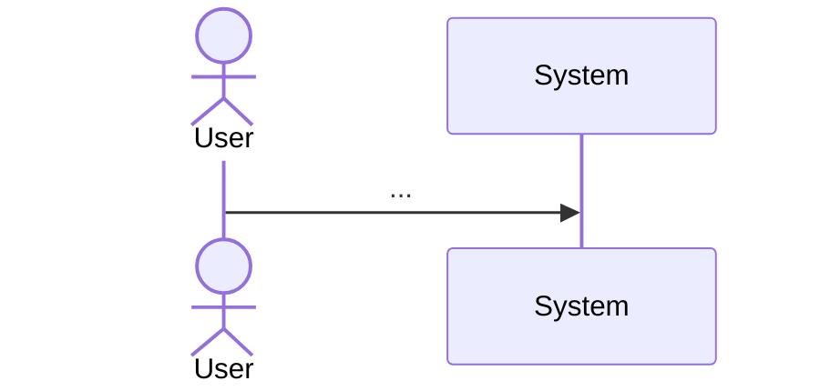

# PRD template (`.team/epics/<epic-slug>/PRD.md`)

One PRD per epic. `board.py add-task --epic <slug>` leaves a stub at that path; replace it with this.
Keep it a page or two: dev and QA read it for context, the tasks carry the testable detail.

```markdown
# PRD — <Epic name>

_Epic: `<slug>` · Milestone(s): M1 · Status: draft | approved by owner · Updated: <date>_

## 1. Problem and who has it
<2–4 sentences: the user, the pain, the evidence (link `docs/research/...` if there is any).>

## 2. Goals and success metrics
- G1 — <outcome you can measure: "a learner can finish a test and see feedback in < 2 s", "80% of
  anonymous visitors reach a result page">

## 3. Non-goals
- <what this epic deliberately does not do, and why — this stops scope creep in review>

## 4. User flow


## 5. Requirements
| ID | Requirement | Priority | Tasks |
|---|---|---|---|
| R1 | <one testable statement> | Must / Should / Could | T-0xx |

Every **Must** maps to at least one task, and each task's acceptance criteria cite the R-ids they
satisfy. A Must with no task is a hole in the plan; a task citing no R-id is probably scope creep.

## 6. Data, API and security notes
<entities and relations (`erDiagram` if it helps), endpoint list, authz rules, sensitive data,
expected load. Detailed contracts belong in the task; this is the overview.>

## 7. Edge cases and failure modes
- <empty / max / invalid / duplicate / concurrent / dependency down — what should happen>

## 8. Later / out of scope for now
- <real ideas deliberately parked, so they are not re-proposed every sprint>

## 9. Open questions
- Q-0xx — <question> (owner decisions live on the board; list the id here so the PRD shows what is undecided)
```
