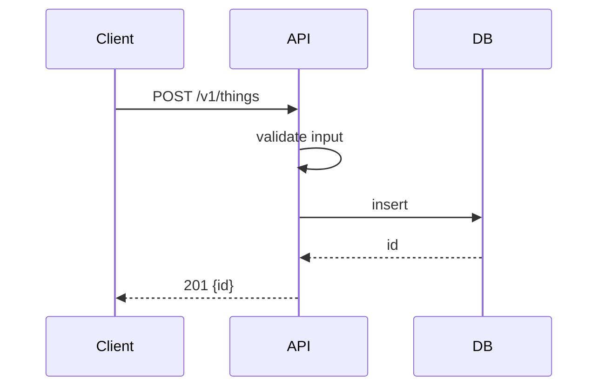

# Task body template (goes in `--body-file`; the script adds status/meta and the Comments list)

```markdown
#### Description
<2–5 sentences: the problem, who benefits, where it fits in the milestone. Link docs/ADRs.>
Epic: `<slug>` — satisfies PRD requirements R1, R3 (`.team/epics/<slug>/PRD.md` §5). <Created with `--epic <slug>`.>

#### Scope
- In: <bullets>
- Out (do not do): <bullets>

#### Acceptance criteria
- [ ] AC1 — <testable statement, observable behaviour> (R1)
- [ ] AC2 — <…> (R1)
- [ ] AC3 — <error / edge behaviour> (R3)

#### Design
Files/modules to touch: `path/a`, `path/b`.

<API contract if relevant>
`POST /v1/things` — body `{ "name": string }` → `201 { "id": string }`; errors: `400 invalid_name`, `409 duplicate`.



Data / state (if any): `erDiagram` or `stateDiagram-v2`.

#### Risk
`low` or `high` (pass as `--risk`): high = auth, personal/payment data, migrations, public API, infra/CI/secrets, big new dependency.

#### Security & performance notes
<authz rules, sensitive data, expected load, indexes, limits>

#### Test plan
- Dev: unit tests for <…>; integration test for <…>. New/changed HTTP endpoint → add/update
  `postman/<epic>.postman_collection.json` (full flow + edge cases; see `dev-workflow/postman-collections.md`).
- QA should probe: <edge cases, abuse cases, performance sanity>; for an API change, run the epic's Postman
  collection twice back to back (auto-variable collisions on the second run are a finding).
```
